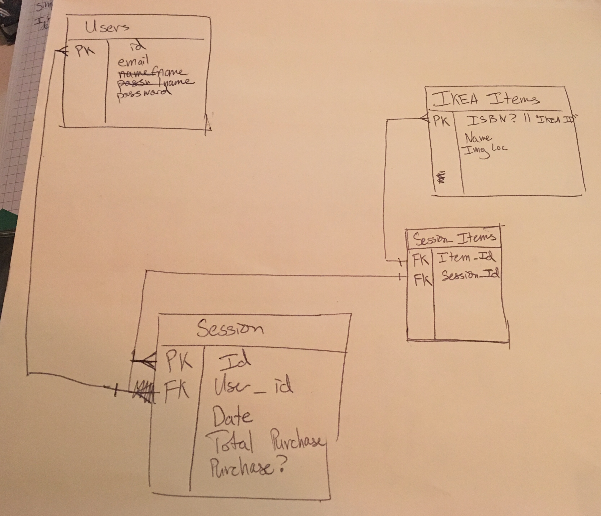

# Purpose

The goal of this application is to create a workable prototype as well as to develop personal skills with a couple of different technologies I haven't played around with yet.

## Technologies

- React
- Browserify
- Mocha/Chai (I've used the Jasmine test-suite before but not this one)
- QR Code API

## Problem

I've only shopped at IKEA twice, but I've noticed every time I've shopped there, I have to either take a picture of the item tag, or write it down in order to remember where I can find it down in the basement below.  This causes a number of different issues.

1. Human Error - it's very easy to either write down the wrong number or take a picture that doesn't include the entire list.
2. Price - it's difficult to track the total cost of your order as you shop.
3. Multiple locations - often you need to find multiple boxes for a single item, if you either don't write this down or forget, you won't know until you're already at the purchase counter, or (worse) after you left the building.
4. Verification - Once you do collect all of your items, it's difficult to easily tell if you got everything you wanted.

## Solution

I'm proposing a rather simple QR code scanner app that would populate a personal shopping list as you go.  It would inform you of the cost, quantity, and show an image of the items you plan on picking up.  It would also generate a QR code that could be scanned during checkout, and you could verify you had purchased all the items you wanted to.

## Updates

### Febrary 17

Created a data structure to handle users with multiple sessions.  Also added some prototypes that are linked below.

[Prototypes](prototype.md)
